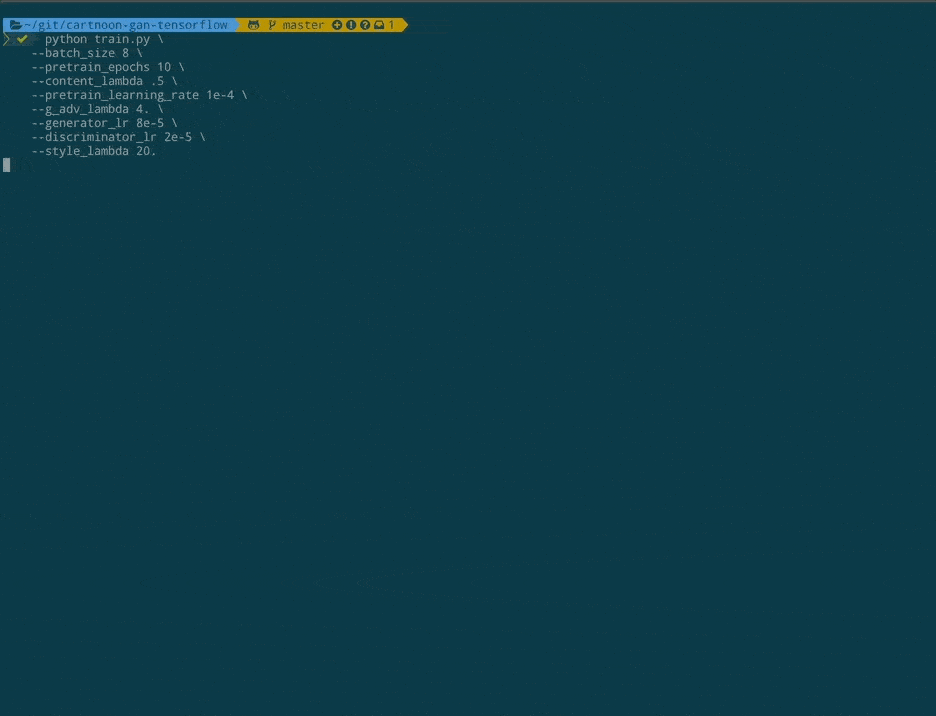
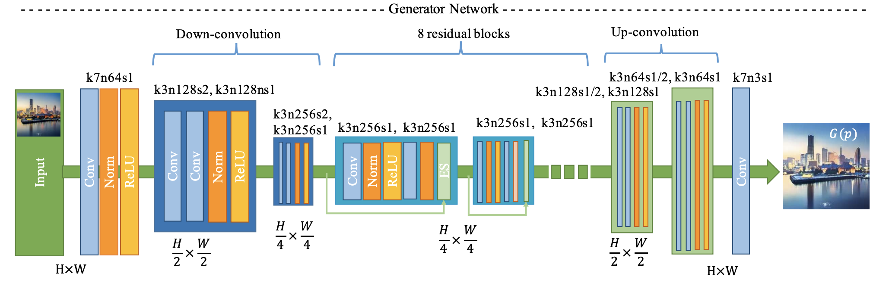
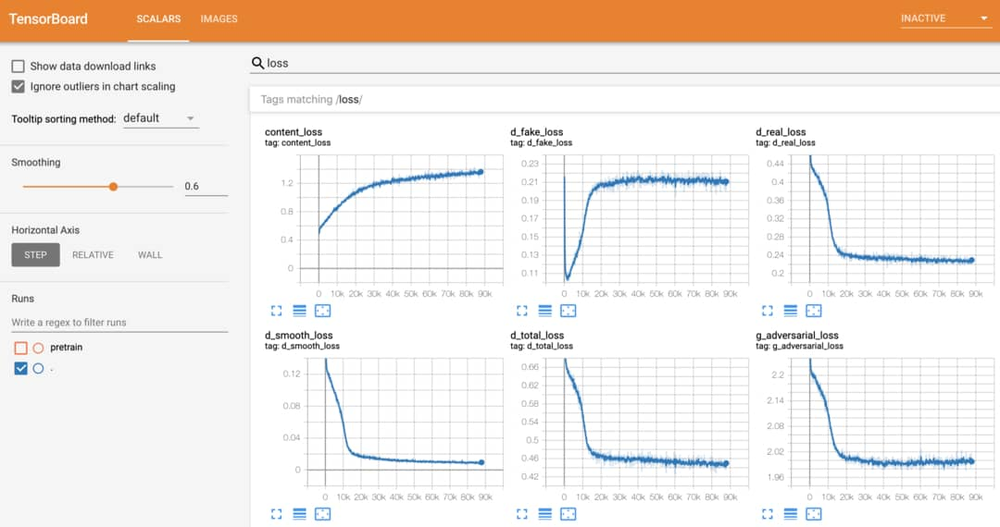
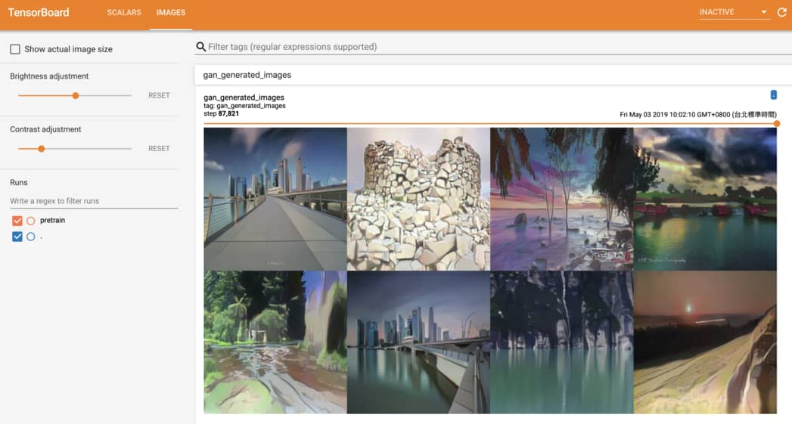
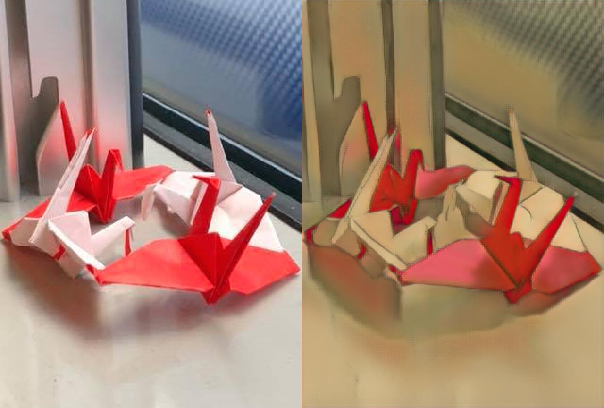
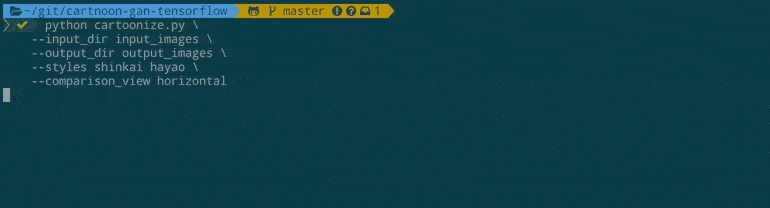

# CartoonifyGAN


Top-left corner is real world image, and the other 3 images are generated by CartoonGAN using different anime styles.

This repo demonstrates how to:
- [Train your own CartoonGAN](#Train-your-own-CartoonGAN)
- [Generate anime using trained CartoonGAN](#generate-anime-using-trained-cartoongan)

## Train your own CartoonGAN

In this section, we will explain how to train a CartoonGAN using the script we provide.

### Setup Environment

First clone this repo:

```bash
git clone https://github.com/mnicnc404/CartoonGan-tensorflow.git
```

To run code in this repo properly, you will need:
- [Python 3.6](https://www.python.org/downloads/release/python-360/)
- [TensorFlow 2.0 Alpha](https://www.tensorflow.org/alpha)
- [tqdm](https://github.com/tqdm/tqdm)
- [imageio](https://pypi.org/project/imageio/)
- [tb-nightly](https://pypi.org/project/tb-nightly/)

For environment management, we recommend [Conda](https://conda.io/projects/conda/en/latest/user-guide/install/index.html#regular-installation). You can get `conda` by installing [Anaconda](https://www.anaconda.com/distribution/#download-section) or [Miniconda](https://docs.conda.io/en/latest/miniconda.html).
You can install all the packages by running the following commands:

```bash
# Select .yml file depending on your os and whether GPU is available
# environment_linux_gpu.yml for linux with nvidia gpu
# environment_linux_cpu.yml for linux without nvidia gpu
# environment_mac_cpu.yml for mac without nvidia gpu
conda env create -n cartoongan -f environment_linux_gpu.yml
# Installs python==3.6.8 to the new environment
conda activate cartoongan
# to deactivate this env, run "conda deactivate"
```

If Anaconda is not available, you can also run:

```bash
pip install -r requirements_gpu.txt
# use `requirements_cpu` if GPU is not available
```

You will also need TensorFlow version of [keras-contrib](https://github.com/keras-team/keras-contrib) for some custom Keras layers used in our CartoonGAN implementation:

```bash
git clone https://www.github.com/keras-team/keras-contrib.git \
    && cd keras-contrib \
    && python convert_to_tf_keras.py \
    && USE_TF_KERAS=1 python setup.py install
```

If all above complete successfully, you're good to go.

### Prepare Dataset

You also need to prepare your own dataset and arrange the images under `datasets` folder as below: 

```text
datasets
└── YourDataset [your dataset name]
    ├── testA [(must) 8 real-world images for evaluation]
    ├── trainA [(must) (source) real-world images]
    ├── trainB [(must) (target) cartoon images]
    └── trainB_smooth [(must, but can be generated by running scripts/smooth.py) cartoon images with smooth edges]
```    

`trainA` and `testA` folders contain real-world images, while `trainB` contain images with desired cartoon style. Notice that 8 images in `testA` folder will be evaluated after each epoch, so they should not appear in `trainA`. 

In order to generate `trainB_smooth`, you can run `scripts/smooth.py`:

```
python path/to/smooth.py --path path/to/datasets/YourDataset  # YourDataset should contain trainB for executing this script

```

[smooth.py credit to taki0112 https://github.com/taki0112/CartoonGAN-Tensorflow/blob/master/edge_smooth.py](https://github.com/taki0112/CartoonGAN-Tensorflow/blob/master/edge_smooth.py)

### Start training

Although you may have to tune hyperparameters to generate best result for your own datasets, train following settings that we found effective can be your starting point.

If you get more than 16GB memory in your GPU, you can try these settings (Note that `--light` indicates that we are training GAN with a light-weight generator):

```bash
python train.py \
    --batch_size 8 \
    --pretrain_epochs 1 \
    --content_lambda .4 \
    --pretrain_learning_rate 2e-4 \
    --g_adv_lambda 8. \
    --generator_lr 8e-5 \
    --discriminator_lr 3e-5 \
    --style_lambda 25. \
    --light \
    --dataset_name {your dataset name}
```

Note that `style_lambda` is for `style loss` [(source)](https://arxiv.org/abs/1508.06576).
If your GPU does not have 16GB memory, you can use a smaller `batch_size` and use lower learning rates accordingly. For example, for `batch_size = 4`, you can try:

```bash
python train.py \
    --batch_size 4 \
    --pretrain_epochs 1 \
    --content_lambda .4 \
    --pretrain_learning_rate 1e-4 \
    --g_adv_lambda 8. \
    --generator_lr 4e-5 \
    --discriminator_lr 1.5e-5 \
    --style_lambda 25. \
    --light \
    --dataset_name {your dataset name}
```



Detailed log messages, model architecture and progress bar are all provided. This enable you to gain a better understanding of what is happening when training a CartoonGAN. 

### Choose model architecture

Notice that we specified `--light` in our previous example:

```bash
python train.py \
    ...
    --light \
    ...
```

When specified, [train.py](train.py) will initialize a light-weight [generator](generator.py) for training a CartoonGAN. 

When we design the light-weight generator, [ShuffleNet V2](https://arxiv.org/abs/1807.11164) is taken as our reference. This generator is designed to minimalize inference time while achieving similar effect. We will make some minor adjustments to [discriminator](discriminator.py) as well when `--light` is specified.



Generator proposed by the original CartoonGAN authors 


To train a CartoonGAN with the original generator/discriminator architecture proposed by the [CartoonGAN](http://openaccess.thecvf.com/content_cvpr_2018/papers/Chen_CartoonGAN_Generative_Adversarial_CVPR_2018_paper.pdf) authors, simply remove `--light` option:

```bash
python train.py \
    --batch_size 8 \
    --pretrain_epochs 1 \
    --content_lambda .4 \
    --pretrain_learning_rate 2e-4 \
    --g_adv_lambda 8. \
    --generator_lr 8e-5 \
    --discriminator_lr 3e-5 \
    --style_lambda 25. \
    --dataset_name {your dataset name}
```

### Monitor your training progress

In our repo, TensorBoard is integrated perfectly so you can monitor model's performance easily by:

```bash
tensorboard --logdir runs
```

After training for awhile, you should be able to see something like this:



In addition to metrics and loss functions, it is good practice to keep an eye on the images generated by GAN during training as well. Using our script, monitoring generated images on TensorBoard is a no-brainer:




For further details about training, we recommend reading [train.py](train.py).

### Inference with trained checkpoint

Once your generator is well-trained, you can try cartoonizing with your trained checkpoint:

```
# You should specify --light if your model is trained with --light
# If you didn't specify --light on your training, you should remove --light
# default of --out_dir is out
python inference_with_ckpt.py \
    --m_path path/to/model/folder \
    --img_path path/to/your/img.jpg \
    --out_dir path/to/your/desired/output/folder \
    --light
```
And generated image will be saved to `path/to/your/desired/output/folder/img.jpg`.

### Export checkpoint to SavedModel and tfjs

Once your generator is well-trained, you can export your model to tfjs model and SavedModel:

```
# You should specify --light if your model is trained with --light
# If you didn't specify --light on your training, you should remove --light
# default of --out_dir is exported_models
python export.py \
    --m_path path/to/model/folder \
    --out_dir path/to/your/desired/export/folder \
    --light
```
And exported tfjs model and SavedModel will be saved to `path/to/your/desired/export/folder`.

Note that the whole model architecture is saved to SavedModel and tfjs model, so you don't need to specify `--light` anymore.

You can try cartoonizing with your exported SavedModel:

```
# default of --out_dir is out
python inference_with_saved_model.py \
    --m_path path/to/your/exported/SavedModelFolder \
    --img_path path/to/your/img.jpg \
    --out_dir path/to/your/desired/output/folder
```

And generated image will be saved to `path/to/your/desired/output/folder/img.jpg`.

We trained 2 model checkpoints and put them in the repo: `light_paprika_ckpt` and `light_shinkai_ckpt` (~7MB Total). You can play around the ckpts with `inference_with_ckpt.py` and `export.py`.

Also, we put our exported shinkai and paprika SavedModels in `exported_models` (~11MB Total). You can play around the SavedModels with `inference_with_saved_model.py`.

Image generated using our `exported_models/light_paprika_SavedModel` (left: original; right: generated):



### (Will be deprecated) Export checkpoint to frozen_pb

This script is just a demontration of backward compatibility.

```
# You should specify --light if your model is trained with --light
# If you didn't specify --light on your training, you should remove --light
# default of --out_dir is optimized_pbs
python to_pb.py \
    --m_path path/to/your/exported/SavedModelFolder \
    --out_dir path/to/your/desired/export/folder \
    --light
```

## Generate anime using trained CartoonGAN

In this section, we explain how to generate anime using **trained** CartoonGAN.

If you don't want to train a CartoonGAN yourself (but want to generate anime anyway), you can simply visit [CartoonGAN web demo](https://leemeng.tw/generate-anime-using-cartoongan-and-tensorflow2-en.html) or run [this colab notebook](https://colab.research.google.com/drive/1WIZBHix_cYIGsBKa4phIwCq5qXwO8fRX).

We will describe these methods in details in one minute.


You can start with preferred approach or watch the demos first (shown below).

Currently, there are 4 styles available:
- `shinkai`
- `hayao`
- `hosoda`
- `paprika`

For demo purpose, let's assume we want to transform [input_images/temple.jpg](input_images/temple.jpg):


To cartoonize this image with `shinkai` and `hayao` styles, you can run:

```commandline
python cartoonize.py \
    --input_dir input_images \
    --output_dir output_images \
    --styles shinkai hayao \
    --comparison_view horizontal
```



The transformed result will be saved as [output_images/comparison/temple.jpg](output_images/comparison/temple.jpg) like this:


The left-most image will be the original image, followed by the styled result specified using `--styles` option.

To explore all options with detailed explaination, simply run `python cartoonize.py -h`:


